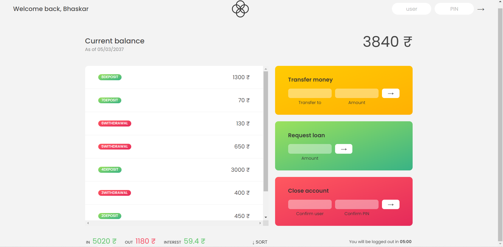

# Bankist-Bank-Dashboard-JavaScript-Project

## About

This project is build using javascript, html and css. I have learn this project from [The Complete JavaScript Course 2023: From Zero to Expert!](https://www.udemy.com/course/the-complete-javascript-course/) by [Jonas Schmedtmann](https://twitter.com/jonasschmedtman).

In this project I have Used all the javascript array methods. Learn so much new things while building this project.

## ⚙️ What did I learn by making this project?

- Javascript Array Mthods :-
  - forEach()
  - map()
  - filter()
  - reduce()
  - some()
  - every()
  - find()
  - findIndex()
  - flat()
  - faltMap()
  - reverse()
  etc.
- Learn method chaining.
- learn optional chaining.
- learn using insertAdjacentHTML.

## ⌛ Time taken to finish this project?

This project took me around 4 hour to finish.

## 📷 Screenshots

